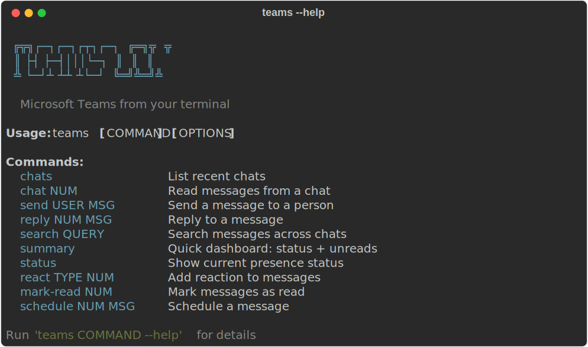
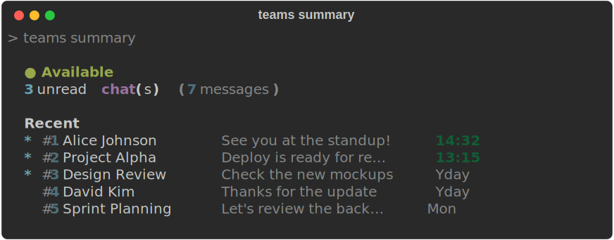
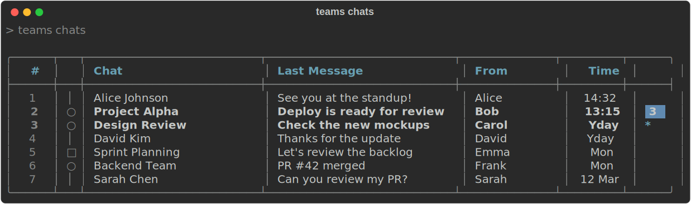
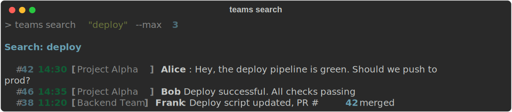
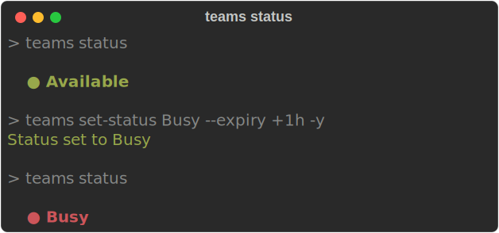

# microsoft-teams-cli

Chat, send, and manage Microsoft Teams from the terminal.

Uses MSAL token extraction via Playwright — no Azure app registration, admin consent, or API keys required.

<p align="center">
  
</p>

> **Disclaimer**: This is an unofficial, community-driven project. It is **not affiliated with, endorsed by, or supported by Microsoft Corporation**. "Microsoft Teams" and "Microsoft 365" are trademarks of Microsoft Corporation.
>
> This tool accesses Microsoft Teams services using intercepted browser tokens and undocumented internal APIs (IC3 Chat Service, UPS Presence). **Use of this tool may violate [Microsoft's Terms of Service](https://www.microsoft.com/en-us/servicesagreement)** or your organization's acceptable use policies. The authors accept no responsibility for account suspensions, data loss, or other consequences arising from the use of this tool.
>
> **Use at your own risk.** This software is provided "as is", without warranty of any kind. See [LICENSE](LICENSE) for details.

## Install

```sh
pip install microsoft-teams-cli
playwright install chromium
```

## Auth

```sh
teams login              # opens browser, captures tokens automatically
teams login --force      # force re-login, ignore saved session
teams login --with-token # read token from stdin (for CI/CD)
teams whoami             # verify current user
```

Token is cached at `~/.cache/teams-cli/tokens.json`. Auto re-login on 401.
You can also set `TEAMS_IC3_TOKEN` env var directly.

## Usage

### Summary Dashboard

Quick overview of your status, unread chats, and recent activity — all in one command with parallel API calls.

```sh
teams summary              # status + unreads + recent activity
teams summary --json       # JSON output
```

<p align="center">
  
</p>

### Chats

```sh
teams chats                        # list recent chats
teams chats --unread               # unread only
teams chats -n 10                  # last 10 chats
teams chats --offset 25            # skip first 25 (pagination)
teams chat 1                       # read messages from chat #1
teams chat 1 -n 50                 # last 50 messages
teams chat 1 --after 2026-03-01    # after date
teams chat 1 --before 2026-03-15   # before date
teams unread                       # list unread chats with message preview
```

<p align="center">
  
</p>

<p align="center">
  
</p>

### Read / Search

```sh
teams read 3                       # read message #3 in detail
teams read 3 --raw                 # raw HTML body
teams search "keyword"             # search messages
teams search "keyword" --max 10 --from "John" --after 2026-03-01
teams search "keyword" --chat 1    # search within a specific chat
teams user-search "john"           # find users by name or email
```

<p align="center">
  
</p>

### Send / Reply

All send commands show a confirmation prompt before sending. Use `-y` to skip.

```sh
teams send "John" "Hello!"                 # send to person by name
teams send "john@company.com" "Hello!" -y  # send by email, skip confirm
teams send "John" "<b>Bold</b>" --html     # send HTML message
teams chat-send 1 "Hello team!"            # send to chat #1
teams chat-send 1 "Meeting at 3pm" -y      # skip confirmation
teams reply 42 "On it."                    # reply to message #42
teams reply 42 "Sounds good" -y            # reply, skip confirmation
```

<p align="center">
  
</p>

### Files

```sh
teams send-file 1 report.pdf                  # upload file to chat #1
teams send-file 1 report.pdf --message "FYI"  # with a message
teams attachments 42                          # list attachments on message #42
teams attachments 42 --download               # download all
teams attachments 42 -d --save-to ./files     # download to specific dir
```

### Message Management

```sh
teams edit 42 "Updated text"        # edit message #42
teams delete 42                     # delete (with confirmation)
teams delete 42 -y                  # delete without confirmation
teams forward 42 1 --comment "FYI"  # forward message to chat #1
teams mark-read 42 43 44            # mark multiple as read
teams mark-read --chat 1 2 3 -y    # mark chats as read by chat number
teams mark-read 42 --unread         # mark as unread
```

### Group Chat

```sh
teams group-chat "Alice" "Bob" --topic "Project X" --message "Kickoff!" -y
```

### Reactions (multi-ID)

```sh
teams react like 42 43 44 -y       # like/heart/laugh/surprised/sad/angry
teams unreact like 42 43 44 -y
```

### Scheduled Messages

```sh
teams schedule 1 "Reminder" "+1h"            # send in 1 hour
teams schedule 1 "Standup" "tomorrow 09:00"  # send tomorrow at 9am
teams schedule 1 "Report" "2026-03-15T10:00" # specific datetime
teams schedule-list                          # list scheduled messages
teams schedule-cancel 1                      # cancel by list number
teams schedule-run                           # run the scheduler (sends due messages)
```

Time formats: `+30m`, `+1h`, `+2h30m`, `today 17:00`, `tomorrow 09:00`, `2026-03-15T10:00`.

### Presence

```sh
teams status                        # show your current status
teams set-status Available          # set status
teams set-status Busy --expiry +1h  # set for 1 hour
teams set-status DoNotDisturb --expiry +2h -y
```

Available statuses: `Available`, `Busy`, `DoNotDisturb`, `BeRightBack`, `Away`, `Offline`.

<p align="center">
  
</p>

### Meetings, Recordings & Transcripts

```sh
teams meetings                      # upcoming meetings (next 7 days)
teams meetings --past --days 14     # past meetings
teams meetings --today              # today's meetings
teams recordings 1                  # list recordings for meeting #1
teams transcripts 1                 # list transcripts for meeting #1
teams transcripts 1 --view          # display transcript in terminal
teams transcripts 1 --download t.vtt # save transcript to file
```

> **Note:** Transcript access uses a SharePoint cookie-based fallback (via Playwright headless browser) because the Teams web SPA token lacks the `OnlineMeetings.Read` scope. Run `teams login` first and re-login if transcripts stop working (cookies expire). Transcripts are returned in VTT format without speaker attribution.

## JSON Output

**Auto-JSON on pipe:** When stdout is piped, JSON output is automatic — no `--json` flag needed.

```sh
teams chats | jq '.data[0].topic'          # auto-JSON when piped
teams chats --json                         # explicit JSON in terminal
```

All JSON output uses a structured envelope:

```json
{"ok": true, "schema_version": "1.0", "data": [...]}
```

## How It Works

1. `teams login` opens Teams in Chromium via Playwright
2. You log in normally (password, MFA, SSO)
3. Teams SPA stores MSAL tokens in `localStorage`
4. CLI extracts multiple tokens by audience:
   - IC3 for chats/messages/group-chats
   - Graph for user search/file uploads
   - Presence for UPS presence read/write
   - Substrate for search
5. Tokens are cached at `~/.cache/teams-cli/tokens.json`
6. Messages get short display numbers (#1, #2...) mapped to real Teams IDs
7. Auto re-login on token expiry via cached browser SSO state

## Security Notice

This tool caches sensitive authentication data on your local machine:

- **Bearer tokens** (`~/.cache/teams-cli/tokens.json`) — grants access to your Teams chats, messages, and profile until they expire. Protect this file as you would a password.
- **Browser session state** (`~/.cache/teams-cli/browser-state.json`) — contains cookies and SSO state that can be used to obtain new tokens without re-authentication.

Both files are created with `600` permissions (owner-only read/write) on Unix systems. Never share these files or commit them to version control.

To revoke access, delete the cache directory:

```sh
rm -rf ~/.cache/teams-cli/
```

## Undocumented API Notice

Most commands use the IC3 Chat Service API, which is a **reverse-engineered internal Teams API** — not a public or documented Microsoft API. The UPS Presence API (`forceavailability`) is also undocumented. These endpoints may change or stop working at any time without notice. User search and file uploads use the [Microsoft Graph API](https://learn.microsoft.com/en-us/graph/overview), which is a documented public API.

## Config

`~/.config/teams-cli/config.yaml`:

```yaml
max_messages: 25
max_chats: 25
browser:
  headless: false
  timeout: 120
output_format: table
jitter:
  read_base: 0.3
  write_base: 2.0
```

## Environment Variables

| Variable | Description |
|----------|-------------|
| `TEAMS_IC3_TOKEN` | Override IC3 token (skip login) |
| `TEAMS_REGION` | Override region (default: auto-detected) |
| `TEAMS_PROXY` | HTTP proxy URL |
| `TEAMS_TIMEOUT` | HTTP request timeout in seconds (default: 30) |
| `TEAMS_CLI_CACHE` | Cache directory (default: `~/.cache/teams-cli`) |
| `TEAMS_CLI_CONFIG` | Config directory (default: `~/.config/teams-cli`) |

## Development

```sh
git clone https://github.com/yusufaltunbicak/microsoft-teams-cli.git
cd microsoft-teams-cli
pip install -e ".[test]"
playwright install chromium
pytest
```
