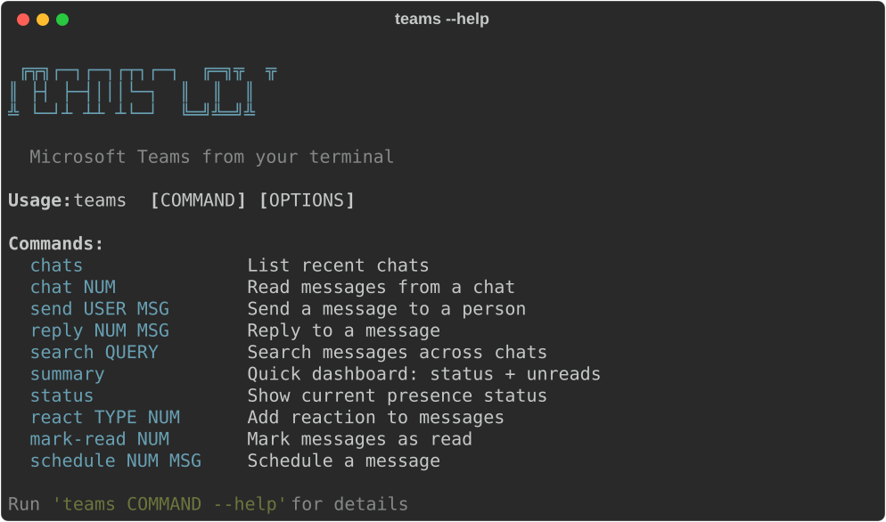
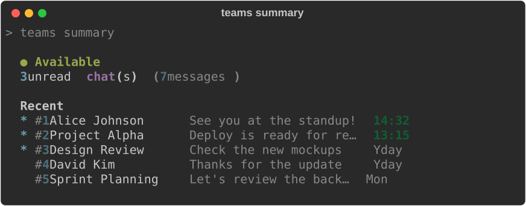
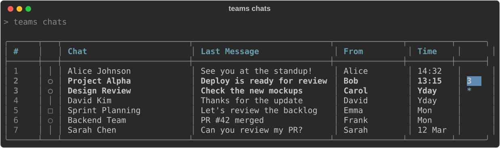
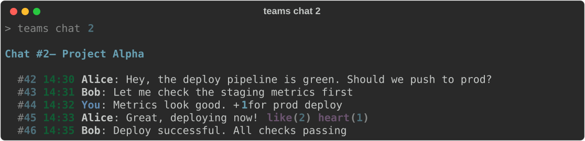
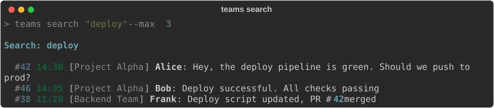
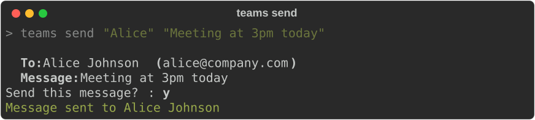
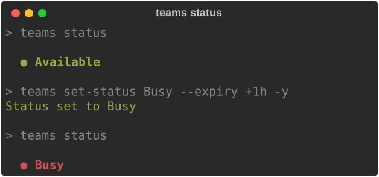

# microsoft-teams-cli

Chat, send, and manage Microsoft Teams from the terminal.

Uses MSAL token extraction via Playwright — no Azure app registration, admin consent, or API keys required.

<p align="center">
  
</p>

> **Disclaimer**: This is an unofficial, community-driven project. It is **not affiliated with, endorsed by, or supported by Microsoft Corporation**. "Microsoft Teams" and "Microsoft 365" are trademarks of Microsoft Corporation.
>
> This tool accesses Microsoft Teams services using intercepted browser tokens and undocumented internal APIs (IC3 Chat Service, UPS Presence). **Use of this tool may violate [Microsoft's Terms of Service](https://www.microsoft.com/en-us/servicesagreement)** or your organization's acceptable use policies. The authors accept no responsibility for account suspensions, data loss, or other consequences arising from the use of this tool.
>
> **Use at your own risk.** This software is provided "as is", without warranty of any kind. See [LICENSE](LICENSE) for details.

## Install

```sh
pip install microsoft-teams-cli
playwright install chromium
```

## Auth

```sh
teams login              # opens browser, captures tokens automatically
teams login --force      # force re-login, ignore saved session
teams login --silent     # refresh the saved session without opening a browser
teams login --with-token # read token from stdin (for CI/CD)
teams whoami             # verify current user
teams auth-status --json # inspect auth/cache health without signing in
```

Tokens are cached at `~/.cache/teams-cli/tokens.json`. Ordinary commands renew
expired tokens silently from the saved MSAL session, including secondary tokens
needed for search or user lookup. They never open a browser in the middle of a
read. If Microsoft requires sign-in or MFA, the command stops with auth exit code
`4` and tells you to run `teams login`. Only explicit `teams login` opens Chromium;
`--no-input` disables interactive login. Refreshes are bounded and locked across
processes so concurrent commands do not rotate the same session repeatedly.

Both legacy MSAL token keys and current `msal.2|...|accesstoken|...` records are
recognized. The session remains subject to Microsoft token expiry, MFA and tenant
policy; silent renewal cannot remove an interaction Microsoft requires.
You can also set `TEAMS_IC3_TOKEN` directly. An expired environment override must
be replaced or unset; it is never silently exchanged for a different account.

## Usage

### Summary Dashboard

Quick overview of your status, unread chats, and recent activity — all in one command with parallel API calls.

```sh
teams summary              # status + unreads + recent activity
teams summary --json       # JSON output
```

<p align="center">
  
</p>

### Chats

```sh
teams chats                        # list recent chats
teams chats --unread               # unread only
teams chats -n 10                  # last 10 chats
teams chats --offset 25            # skip first 25 (pagination)
teams chat 1                       # read messages from chat #1
teams chat "Project X"            # resolve a unique chat title or person's name
teams chat 1 -n 50                 # last 50 messages
teams chat 1 --after 2026-03-01    # after date
teams chat 1 --before 2026-03-15   # before date
teams unread                       # list unread chats with message preview
```

<p align="center">
  
</p>

<p align="center">
  
</p>

### Read / Search

```sh
teams read 3                       # read message #3 in detail
teams read 3 --raw                 # raw HTML body
teams read 3 --context 2           # message plus up to two messages on each side
teams search "keyword"             # search messages
teams search "keyword" --max 10 --from "John" --after 2026-03-01
teams search "keyword" --chat 1    # search within a specific chat
teams search "keyword" --chat "Project X" # chat title instead of a display number
teams search "keyword" --context 2 # bounded surrounding conversation for each hit
teams user-search "john"           # find users by name or email
```

Named chat selectors accept an exact title or person name, then a unique partial
match. Ambiguous names fail with a useful error so a command cannot silently pick
the wrong conversation. Numbers and full conversation IDs continue to work.
Context is additive: JSON keeps each message's existing fields and includes a
`context` array and `context_meta` counts only when requested. Live windows can
contain membership/call events; the CLI expands the raw window when needed, at
most three window reads capped at 200 raw events per request; a missing anchor
can require one direct-message read. Conversation boundaries
or index gaps can return fewer neighbors; `context_meta.partial` makes that
visible. Deleted-message tombstones are excluded; reading a deleted anchor
returns not-found. Use a small `--max` for an initial investigation.

Live search sends sender/chat/date constraints to the server index before
selecting the top hits. Timezone-free dates and datetimes mean UTC. Search treats
`--before YYYY-MM-DD` as including that UTC day; for a local timezone use explicit
ISO offsets, for example `--after 2026-09-01T00:00:00+03:00`
`--before 2026-09-30T23:59:59+03:00`.

<p align="center">
  
</p>

### Local history search

Local history is opt-in. `sync` stores message text on this machine; ordinary
commands do not create a message-history archive. It reads Teams without marking
messages read and does not send, edit or change presence.

```sh
teams sync --days 60 --chats 50 --max-pages 5
teams search "toplantı" --local
teams search "toplantı" --local --from "John" --after 2026-09-01 --before 2026-09-30 --context 2
teams search "toplantı" --local --chat "Project X" --json
teams cache status --json

# Optional repeating read sync in this terminal; Ctrl-C stops it:
teams sync --days 60 --chats 50 --max-pages 5 --watch 300

# Remove message text for every cached account, keeping names/auth/schedules:
teams cache clear --messages-only
# Reset only cached names and Graph capability probes, keeping message text:
teams cache clear --metadata-only
# Remove both message history and name/title metadata:
teams cache clear
```

The SQLite full-text index is `~/.cache/teams-cli/history.sqlite3` (`0600`). It
contains plain message text, sender names/IDs, chat titles/IDs and timestamps,
separated by account. No server request or token renewal is needed for
`search --local`; an expired saved token can still identify the cached account.
Search matches prefixes of words and requires every query word, with Turkish
case/diacritic normalization. Local sender/date/chat filters apply inside the
indexed query rather than filtering a short result page afterward.

Sync defaults to 50 recent chats, 60 days and at most five pages of 100 messages
per chat. This is bounded coverage, not every message in every chat. Check
`meta.source` and `meta.coverage` in local-search JSON, or `cache status`, for the
indexed message count, chats, last-sync time and incomplete per-chat coverage. A complete
flag refers to the requested window in those selected chats. Live search remains
available for material outside the index. Permission-denied or unavailable chats,
page limits and repeated cursors are reported as incomplete with a reason; sync
continues with the other selected chats. Repeated sync updates observed edits
and deletions in the pages it revisits; older unvisited changes can remain stale.
Imported text persists until cache deletion; `--days` bounds the current import
and does not erase older rows from a previous wider import.
`--watch` is a foreground loop with a minimum interval of 60 seconds; no daemon,
startup service or scheduler is installed.

Stop a running watch loop before clearing its files. Cache deletion asks for
confirmation and supports `--yes`, global `--dry-run`,
`--force` and `--no-input`. It deletes history/metadata for all cached accounts,
including SQLite companion files, while preserving auth tokens, browser state,
ID maps and scheduled messages. `TEAMS_CLI_CACHE` relocates all these files.
`--metadata-only` preserves message history; `--messages-only` preserves metadata.
The two selectors cannot be combined.

### Send / Reply

All send commands show a confirmation prompt before sending. Use `-y` to skip.

```sh
teams send "John" "Hello!"                 # send to person by name
teams send "john@company.com" "Hello!" -y  # send by email, skip confirm
teams send "John" "<b>Bold</b>" --html     # send HTML message
teams chat-send 1 "Hello team!"            # send to chat #1
teams chat-send 1 "Meeting at 3pm" -y      # skip confirmation
teams reply 42 "On it."                    # reply to message #42
teams reply 42 "Sounds good" -y            # reply, skip confirmation
```

<p align="center">
  
</p>

### Files

```sh
teams send-file 1 report.pdf                  # upload file to chat #1
teams send-file 1 report.pdf --message "FYI"  # with a message
teams attachments 42                          # list attachments on message #42
teams attachments 42 --download               # download all
teams attachments 42 -d --save-to ./files     # download to specific dir
```

### Message Management

```sh
teams edit 42 "Updated text"        # edit message #42
teams delete 42                     # delete (with confirmation)
teams delete 42 -y                  # delete without confirmation
teams forward 42 1 --comment "FYI"  # forward message to chat #1
teams mark-read 42 43 44            # mark multiple as read
teams mark-read --chat 1 2 3 -y    # mark chats as read by chat number
teams mark-read 42 --unread         # mark as unread
```

### Group Chat

```sh
teams group-chat "Alice" "Bob" --topic "Project X" --message "Kickoff!" -y
```

### Reactions (multi-ID)

```sh
teams react like 42 43 44 -y       # like/heart/laugh/surprised/sad/angry
teams unreact like 42 43 44 -y
```

### Scheduled Messages

```sh
teams schedule 1 "Reminder" "+1h"            # send in 1 hour
teams schedule 1 "Standup" "tomorrow 09:00"  # send tomorrow at 9am
teams schedule 1 "Report" "2026-03-15T10:00" # specific datetime
teams schedule-list                          # list scheduled messages
teams schedule-cancel 1                      # cancel by list number
teams schedule-run                           # run the scheduler (sends due messages)
```

Time formats: `+30m`, `+1h`, `+2h30m`, `today 17:00`, `tomorrow 09:00`, `2026-03-15T10:00`.

### Presence

```sh
teams status                        # show your current status
teams set-status Available          # set status
teams set-status Busy --expiry +1h  # set for 1 hour
teams set-status DoNotDisturb --expiry +2h -y
```

Available statuses: `Available`, `Busy`, `DoNotDisturb`, `BeRightBack`, `Away`, `Offline`.

<p align="center">
  
</p>

## JSON Output

**Auto-JSON on pipe:** When stdout is piped, JSON output is automatic — no `--json` flag needed.

```sh
teams chats | jq '.data[0].topic'          # auto-JSON when piped
teams chats --json                         # explicit JSON in terminal
```

All JSON output uses a structured envelope:

```json
{"ok": true, "schema_version": "1.0", "data": [...]}
```

## How It Works

1. `teams login` opens Teams in Chromium via Playwright
2. You log in normally (password, MFA, SSO)
3. Teams SPA stores MSAL tokens in `localStorage`
4. CLI extracts multiple tokens by audience:
   - IC3 for chats/messages/group-chats
   - Graph for user search/file uploads
   - Presence for UPS presence read/write
   - Substrate for search
5. Tokens are cached at `~/.cache/teams-cli/tokens.json`
6. Messages get short display numbers (#1, #2...) mapped to real Teams IDs
7. Ordinary commands silently renew the required resource token from saved MSAL
   refresh-token records; interactive sign-in remains an explicit action
8. Account-scoped names and chat titles survive CLI restarts in a private metadata
   cache; cold user resolution is combined into bounded Graph read batches

## Security Notice

This tool caches sensitive authentication data on your local machine:

- **Bearer tokens** (`~/.cache/teams-cli/tokens.json`) — grants access to your Teams chats, messages, and profile until they expire. Protect this file as you would a password.
- **Browser session state** (`~/.cache/teams-cli/browser-state.json`) — contains cookies and SSO state that can be used to obtain new tokens without re-authentication.
- **Name/title metadata** (`~/.cache/teams-cli/metadata.json`) — user display names,
  chat titles, member IDs and chat types, scoped by account. Message bodies and
  previews are excluded. Names expire after seven days and chat titles after one
  day. Confirmed missing Graph users are cached for five minutes; a native sender
  name replaces that marker immediately. A confirmed Graph presence permission
  denial is remembered for one hour when UPS presence is available; status is
  still fetched live through UPS. Auth/rate-limit/network failures are never
  cached as capability denials. Use `teams cache clear --metadata-only` to force
  fresh resolution without removing message history.
- **Opt-in message history** (`~/.cache/teams-cli/history.sqlite3`) — plain message
  text and sender/chat metadata imported by `sync`. Remove it with
  `teams cache clear --messages-only`; the command also removes SQLite companion
  files and keeps login credentials and schedules.

Authentication, metadata and message-index files are created with `600`
permissions (owner-only read/write) on Unix systems. Never share these files or
commit them to version control.

To remove saved credentials and all local cache data, delete the cache directory:

```sh
rm -rf ~/.cache/teams-cli/
```

## Undocumented API Notice

Most commands use the IC3 Chat Service API, which is a **reverse-engineered internal Teams API** — not a public or documented Microsoft API. The UPS Presence API (`forceavailability`) is also undocumented. These endpoints may change or stop working at any time without notice. User search and file uploads use the [Microsoft Graph API](https://learn.microsoft.com/en-us/graph/overview), which is a documented public API.

## Config

`~/.config/teams-cli/config.yaml`:

```yaml
max_messages: 25
max_chats: 25
browser:
  headless: false
  timeout: 120
output_format: table
jitter:
  read_base: 0.3
  write_base: 2.0
cache:
  metadata: true
```

The read/write jitter defaults are preserved. They are now used by HTTP sessions;
changing them is an explicit choice. Smaller delays or larger bursts can increase
throttling risk. Graph batch subrequests still count individually toward service
limits. Disable metadata caching with `cache.metadata: false` if names and chat
titles should not survive command invocations; this also disables short-lived
missing-user and presence-capability metadata.

## Environment Variables

| Variable | Description |
|----------|-------------|
| `TEAMS_IC3_TOKEN` | Override IC3 token (skip login) |
| `TEAMS_REGION` | Override region (default: auto-detected) |
| `TEAMS_PROXY` | HTTP proxy URL |
| `TEAMS_TIMEOUT` | HTTP request timeout in seconds (default: 30) |
| `TEAMS_CLI_CACHE` | Cache directory (default: `~/.cache/teams-cli`) |
| `TEAMS_CLI_CONFIG` | Config directory (default: `~/.config/teams-cli`) |

## Development

```sh
git clone https://github.com/yusufaltunbicak/microsoft-teams-cli.git
cd microsoft-teams-cli
pip install -e ".[test]"
playwright install chromium
pytest
```

Read-only timings can be reproduced with
`python3 scripts/benchmark_read.py --label current --runs 3 --cache-mode warm --skip-preflight`.
The script stores timings and counts under the private cache, never response
content. See [PERFORMANCE.md](PERFORMANCE.md) for methodology, alternatives and
measurement limits.
